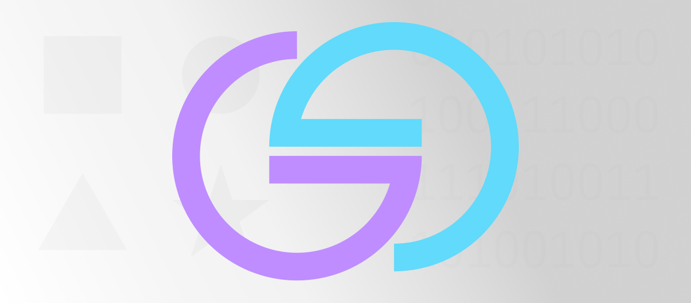

# Glypfig

[](https://www.patreon.com/Glypfig)

The icon library workflow for Figma.



Picks up your existing icons from Figma and outputs them ready for production. Currently supported export formats include JPG, PDF, PNG, SVG and React. Can also optimize image assets and build UI components according to an editable template.

## Prerequisites

* [NodeJS](https://nodejs.org/) installed
* [Figma](https://www.figma.com/) project with a page that has a frame or similar container with icon components
* Figma API key – Generate new personal access token at Settings -> Account -> Personal access tokens
* File key – Your file's (with the icon components) key identifier e.g. figma.com/file/{figma-file-key}/Glypfig
* Node ID – Your frame's [URL decoded](https://www.urldecoder.io/) node ID e.g. figma.com/...?node-id=0%3A1 (URL decoded to 0:1)

### Figma notes

To exclude a component to be exported from the frame prefix it's name with a dot e.g. ".Title".

For best results always have your icon component's main layer in Figma boxed with equal width and height e.g. 24x24px.

## Get started

1. Install Glypfig from [NPM](https://www.npmjs.com/package/glypfig) with `npm` or `yarn`.

    ```shell
    npm install --save-dev glypfig
    ```

    ```shell
    yarn add --dev glypfig
    ```

2. Run with your preferred configuration. See all the possible options below.

    ```shell
    glypfig --apikey <figma-api-key> --filekey <figma-file-key> --nodeid <icon-frame-node-id>
    ```

### configuration

| Parameter        |  Flag       | Value   | Default                   | Options                                           |
| ---------------- | ----------- | ------- | --------------------------|-------------------------------------------------- |
| Figma API Key    | apikey, a   | string  | None                      | Figma: Settings/Account/Personal access tokens    |
| File key         | filekey, k  | string  | None                      | figma.com/file/{figma-file-key}/Glypfig           |
| Node ID          | nodeid, n   | string  | None                      | figma.com/...?node-id=0%3A1 URL decoded to 0:1    |
| Output format    | format, f   | string  | png,svg,react             | jpg, png, svg, pdf and react                      |
| Output path      | output, o   | string  | icon-library              | e.g. ./the-path/to/your-icons                     |
| Silent logging   | silent, s   | boolean | false                     | true or false                                     |
| Optimize files   | optimize, p | boolean | false                     | true or false                                     |
| Template format  | template, t | string  | jsx                       | jsx or tsx                                        |
| Template path    | path, h     | string  | ./templates/react-jsx.eta | e.g. ./the-path/to/your-template-tsx.eta          |

## More

[Support](https://www.patreon.com/Glypfig) this project
